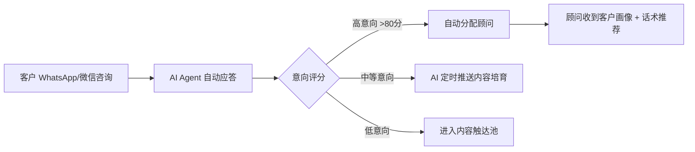

# 签证移民行业 AI 获客智能体方案

## 一、方案概述

参考联想乐享销售智能体的核心架构（智能 Call Plan、客户画像、商机预测、智能推荐、内容生成、数据分析六大功能模块），结合签证移民行业的业务特点，设计一套端到端的 AI 获客智能体系统。

---

## 二、行业痛点与 AI 解决方案

| 痛点 | AI 智能体对策 |
|------|--------------|
| 客户线索获取效率低、渠道分散 | **智能商机挖掘**：多源线索聚合 + AI 打分排序 |
| 咨询量大但转化率低 | **智能咨询 Agent**：7×24 AI 自动应答，筛选高意向客户 |
| 客户意向判断依赖人工经验 | **客户画像与评分**：行为轨迹 + 对话数据 → AI 意向评分 |
| 各国政策频繁变动，顾问知识更新滞后 | **政策知识引擎**：RAG + 实时抓取各国移民局/使领馆公告 |
| 跟进不及时，客户流失 | **智能 Call Plan**：动态跟进策略，最佳触达时机推荐 |
| 获客内容产出慢、质量不稳定 | **AI 内容工厂**：自动生成移民攻略、签证指南、成功案例 |
| 竞品动态和市场需求盲区 | **市场情报 Agent**：竞品监控 + 关键词趋势分析 |

---

## 三、核心功能模块（对标联想销售智能体）

### 模块一：智能商机挖掘（Intelligent Lead Mining）

对标联想「智能 Call Plan」的精准获客能力。

**功能点：**
- **小红书/抖音/微信公众号内容引流**：AI 生成签证攻略、移民政策解读等内容，嵌入转化入口
- **百度/Google SEO 长尾词占领**：自动分析高意向关键词（如"美国EB1A条件""澳洲技术移民打分"），批量生成优化内容
- **Reddit/知乎/海外问答平台监听**：NLP 监听与签证移民相关的问题，自动回复引导私域
- **入境咨询聚合**：WhatsApp/微信/Line/邮件/网站表单多渠道统一接入
- **广告投放 ROI 优化**：AI 分析各渠道获客成本，智能分配预算

**技术实现：**
- NLP 意图识别 + 多平台 API 聚合
- 大模型驱动的关键词研究 → 自动内容生成 → SEO 排名提升
- 类似 Respond.io 的 AI 对话路由能力

### 模块二：客户画像与智能评分（Lead Scoring & Profile）

对标联想「客户画像」功能，实现客户分层。

**维度：**

| 数据维度 | 采集方式 | 评分权重 |
|---------|---------|---------|
| 年龄/职业/家庭 | 表单 + 对话提取 | 15% |
| 资产状况/预算 | 对话中 AI 主动询问 | 25% |
| 意向国家/项目 | 浏览行为 + 关键词 | 20% |
| 紧迫性（出行时间/孩子年龄等） | 对话提取 | 25% |
| 互动深度（咨询次数/停留时长） | 行为埋点 | 15% |

**输出：**
- A级（高意向，48h内跟进）→ 自动分配资深顾问
- B级（有兴趣，7天孵化）→ AI 定期推送内容培育
- C级（低意向）→ 纳入长期内容触达池

### 模块三：AI 智能咨询 Agent（Conversational AI）

对标联想的对话式 AI 能力，但面向签证移民场景深度定制。

**核心能力：**
- **7×24 自动咨询**：支持中/英/等多语言，覆盖 100+ 签证/移民项目 FAQ
- **智能反问引导**：不满足于被动问答，AI 主动追问关键信息（如"您目前持有哪国护照？""您的预算大概范围？"）
- **政策实时解答**：对接各国移民局 RSS/API，RAG 检索增强生成，回答始终基于最新政策
- **复杂 case 无缝转人工**：当 AI 识别到复杂情况（如拒签史、犯罪记录等），自动转接专业顾问并附上对话摘要
- **文件清单自动生成**：根据客户条件，AI 自动输出所需材料清单 + 时间线

**技术：**
- 大模型（Claude/GPT-4o）+ RAG 知识库
- 嵌入各国签证政策数据库（结构化 + 向量化）
- WhatsApp/微信 Bot 接口

### 模块四：智能 Call Plan（跟进策略引擎）

对标联想「智能 Call Plan」— 这是最核心的销售转化模块。

**功能：**
- **动态跟进序列**：基于客户阶段自动生成触点计划（消息/电话/邮件/视频会议）
- **最佳时机推荐**：分析客户历史互动数据，推荐最优触达时间
- **话术智能生成**：针对不同客户画像 / 项目 / 阶段，AI 生成个性化话术
- **沉默客户激活**：自动识别超过 N 天未互动的沉睡线索，触发激活策略
- **A/B 测试引擎**：对比不同话术/时间/渠道的转化率

**示例序列（美国 EB1A 意向客户）：**
```
Day 0: AI 咨询 → 收集基本信息
Day 1: 自动发送 EB1A 评估报告 (AI 生成)
Day 3: 顾问电话跟进 (AI 推送话术 + 客户背景)
Day 7: 发送成功案例 (AI 匹配相似背景案例)
Day 14: 政策更新推送 (如排期变化)
Day 30: 未转化 → 进入长期培育池
```

### 模块五：AI 内容工厂（Content Engine）

对标联想「内容生成」能力，批量生产获客内容。

**内容类型：**
- **政策解读**：「2026 年 8 月美国 EB5 新政解读」
- **算分工具**：交互式移民打分计算器（澳洲/加拿大/新西兰技术移民）
- **案例故事**：AI 写作 → 人工审核 → 多渠道发布
- **对比文章**：「EB1A vs NIW 怎么选」
- **短视频脚本**：自动生成口播脚本 + AI 配音
- **多语言版本**：同一篇内容自动翻译成英文/日文/韩文等目标客户语言

**分发渠道矩阵：**
- 小红书（签证攻略类）
- 抖音/TikTok（短视频 + 移民故事）
- YouTube（长视频深度解读）
- 微信公众号（综合资讯）
- 知乎/Quora（专业问答）
- 官网 Blog（SEO 长尾流量）

### 模块六：市场情报与数据分析（Market Intelligence）

**功能：**
- **竞品监控**：自动抓取竞品官网/社媒更新、价格变动、新项目发布
- **政策变动预警**：监控 50+ 国家移民局官网，政策变化实时推送
- **关键词趋势**：Google Trends + 百度指数，发现上升需求（如某国突然放宽政策）
- **获客漏斗分析**：从曝光 → 点击 → 咨询 → 转化的全链路数据监控
- **顾问绩效分析**：每位顾问的转化率/客单价/跟进速度，AI 给出改善建议
- **市场预测**：基于历史数据 + 外部信号（政策/汇率/经济），预测未来 3-6 个月热门项目

---

## 四、技术架构

```
┌─────────────────────────────────────────────────┐
│                    用户触点层                      │
│  微信 │ WhatsApp │ 网站 │ 小红书 │ 抖音 │ 邮件    │
└─────────────────────┬───────────────────────────┘
                      │
┌─────────────────────▼───────────────────────────┐
│                  AI Agent 层                     │
│  ┌──────────┐ ┌──────────┐ ┌──────────────────┐ │
│  │ 咨询Agent│ │ 内容Agent│ │ 跟进Agent(Call   │ │
│  │(对话AI)  │ │(内容工厂)│ │  Plan)           │ │
│  └──────────┘ └──────────┘ └──────────────────┘ │
│  ┌──────────┐ ┌──────────┐ ┌──────────────────┐ │
│  │ 评分Agent│ │ 情报Agent│ │ 分配Agent        │ │
│  │(客户画像)│ │(市场监控)│ │(线索→顾问路由)    │ │
│  └──────────┘ └──────────┘ └──────────────────┘ │
└─────────────────────┬───────────────────────────┘
                      │
┌─────────────────────▼───────────────────────────┐
│                   能力底座层                       │
│  大模型(Claude/GPT/Qwen) │ RAG知识库 │ 向量数据库 │
│  CRM/SCRM │ 数据分析 │ 工作流引擎(n8n/Temporal)  │
└─────────────────────┬───────────────────────────┘
                      │
┌─────────────────────▼───────────────────────────┐
│                   数据层                          │
│  客户数据 │ 政策库 │ 内容库 │ 营销数据 │ 外部API  │
└─────────────────────────────────────────────────┘
```

---

## 五、实施路线图

| 阶段 | 时间 | 交付内容 |
|------|------|---------|
| **Phase 1: MVP** | 2-4 周 | 智能咨询 Agent（RAG 知识库 + 多渠道接入）、基础客户画像评分、3-5 种内容模板 |
| **Phase 2: 增长** | 4-8 周 | Call Plan 引擎、内容工厂自动化、广告 ROI 优化、客户分层培育 |
| **Phase 3: 智能** | 8-12 周 | 市场情报 Agent、销售预测、竞品监控、全链路数据分析看板 |

---

## 六、成本估算

| 模块 | 月成本估算 | 说明 |
|------|----------|------|
| 大模型 API（Claude/GPT-4o） | $500-2000 | 咨询对话 + 内容生成 |
| RAG 知识库 + 向量数据库 | $100-300 | 政策库维护 |
| 多渠道消息接入 | $50-200 | WhatsApp/微信 API |
| 服务器/云服务 | $200-500 | 取决于流量 |
| 内容分发/广告 | 按预算 | 可变 |
| **合计（软件）** | **$850-3000/月** | 不含人力 |

### 人效对比（预期）

| 指标 | 纯人工 | AI 智能体后 | 提升倍数 |
|------|--------|------------|---------|
| 单顾问同时跟进客户数 | 10-20 | 50-100+ | 3-5x |
| 咨询首次响应时间 | 数小时 | <30 秒 | 100-1000x |
| 内容产出（篇/周） | 2-5 | 20-50 | 10x |
| 线索→有效咨询转化率 | 2-5% | 8-15% | 3-5x |
| 有效咨询→签约转化率 | 15-25% | 25-40% | 1.5-2x |

---

## 七、核心差异化优势

1. **从被动问答到主动获客**：不只是一个 chatbot，而是一个完整的获客+培育+转化闭环
2. **政策敏感度**：签证移民行业最依赖政策变化，RAG 知识引擎确保信息始终最新
3. **多渠道统一**：无论客户从哪个渠道来，统一画像、统一跟进策略
4. **可量化的 ROI**：每个模块都有清晰的转化指标，持续 A/B 优化
5. **渐进式落地**：可以从 MVP 开始，先跑通咨询 + 评分，再逐步叠加其他模块

---

## 八、与联想销售智能体的类比

| 联想销售智能体 | 签证移民获客智能体 |
|---------------|-------------------|
| 智能 Call Plan → 精准找客户 | → 智能商机挖掘 + 评分排序 |
| 客户画像 → 客户洞察 | → 多维画像 + 移民意向评分 |
| 商机预测 → 销售预测 | → 政策趋势分析 + 热门项目预测 |
| 智能推荐 → 产品推荐 | → 移民/签证项目匹配推荐 |
| 内容生成 → 营销内容 | → 签证攻略/案例/算分工具 |
| 数据看板 → 业绩分析 | → 获客漏斗 + 顾问绩效 + 市场趋势 |

---

## 九、Phase 1 MVP 快速启动建议

### 最小闭环（2-4 周可上线）



### MVP 需要的技术组件

| 组件 | 推荐方案 | 说明 |
|------|---------|------|
| 大模型 | Claude API (Anthropic) | 对话质量最高，多语言能力强 |
| 渠道接入 | WhatsApp Business API + 微信企业号 | 覆盖主要的海外/国内客户 |
| 知识库 | 向量数据库 (Pinecone/Supabase pgvector) | 存储各国政策 FAQ |
| 工作流引擎 | n8n (已有) | 可复用现有的 WhatsApp Task Agent 基础设施 |
| CRM | 轻量 CRM（Notion/Airtable 起步） | MVP 阶段无需重型系统 |
| 前端 Dashboard | 复用现有 Task Dashboard 模板 | 改造成客户管理面板 |

### MVP 的具体实现步骤

1. **Day 1-3**：搭建 Claude API + RAG 知识库（载入美国 EB1A/EB5/NIW、加拿大 Express Entry、澳洲技术移民等 Top 10 项目的 FAQ）
2. **Day 4-7**：基于现有 WhatsApp Task Agent 的 n8n 工作流，改造成"咨询 → AI 回复 → 存 CRM"的闭环
3. **Day 8-10**：实现客户意向评分（5 个维度，相对简单）
4. **Day 11-14**：Dashboard 改造 + 测试上线

MVP 阶段只做**美国 + 加拿大 + 澳洲**三个国家的 10 个主流移民/签证项目，验证获客转化漏斗。

---

*本方案由 Claude (Anthropic) 基于签证移民行业调研和联想乐享超级智能体架构分析生成，2026 年 8 月。*
